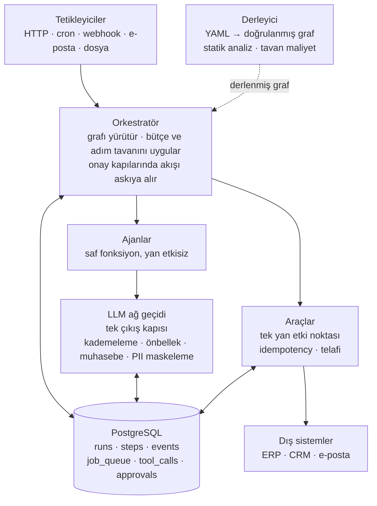

# Otomasyon Omurgası

Kurumsal arka-ofis süreçlerini çalıştıran, çökmeye dayanıklı çoklu-ajan yürütme çekirdeği.

Müşteriye teslim edilen şey kod değil, YAML konfigidir. İş akışı bildirimsel olarak tanımlanır; çekirdek runtime müşteriden müşteriye değişmez.

```
gelen belge → sınıflandır → yapılandırılmış kayıt → insan onayı → hedef sisteme tek yazma
```

Bu desen B2B arka-ofis otomasyonlarının çoğunun iskeletidir: fatura girişi, CV eleme, sigorta hasar dosyası, tedarikçi sözleşme incelemesi, sipariş girişi.

## Neden bu mimari

Bir ajan sistemini kurumsal bir müşteriye satabilmek için üç sorunun cevabı gerekiyor. Mimari bu üç cevabın etrafında kuruldu.

**"Ne kadar tutacak?"** — Derleyici, graftaki en pahalı yolu yürüyerek çalışma başına maliyet üst sınırını hesaplar. Tahminler kaba ve güvenli tarafta; tavanın kesin olması değil, aşılmaması gerekir. Sabit fiyatlı sözleşmenin ön koşulu budur.

**"Yanlış yaparsa ne olur?"** — Her yan etki iki aşamalı kiralı rezervasyondan geçer: rezerve et, çağır, tamamla. Rezervasyon kendi transaction'ında commit edilir. Bir `UNIQUE` kısıtı tek başına yetmez; satır dış çağrıdan sonra yazılırsa iki worker aynı anda dış API'yi çağırır ve yalnızca ikinci `INSERT` reddedilir — çift yazma çoktan olmuştur. Kısıt olayı tespit eder, engellemez.

**"Nasıl kanıtlarsın?"** — Her durum geçişi ekleme-yalnız bir olay kaydına yazılır ve veritabanı tetikleyicisi `UPDATE`'i reddeder. Denetim izi uygulama disiplinine değil şema kısıtına dayanır.

## Beş değişmez kural

Bunlar tasarım tercihi değil, sözleşmedir. İhlalleri derleme ya da çalışma zamanı hatasıdır.

1. **Ajanlar birbirini doğrudan çağırmaz.** Tüm geçişler orkestratör üzerinden ve YAML'da beyan edilmiş kenarlardan olur. Tek geçit olunca her kenar kaydedilebilir, sayılabilir, sınırlanabilir.
2. **Paylaşılan durum sözlüğü yok; tipli kanal var.** Her adım girdisini ve çıktısını Pydantic modeliyle beyan eder. Ortak mutable sözlük, çoklu-ajan hatalarının en yaygın kaynağıdır: kimin neyi bozduğu bilinmez, tek adım izole test edilemez.
3. **Bağlam izolasyonu.** Bir düğüm yalnız `inputs` içinde beyan ettiğini görür. Beyan edilmeyen alan ona verilen sözlükte hiç yoktur. Bu kural hem doğruluğun hem token maliyetinin ana kaldıracıdır.
4. **Ajan saf fonksiyondur; yan etki yalnız araçta.** Her araç idempotency anahtarı, onay gerekliliği ve telafi yordamı beyan etmek zorundadır.
5. **Olay kaydı ekleme-yalnızdır.** Tek mekanizmadan üç şey çıkar: zamanda geri giderek hata ayıklama, değişmez denetim izi, kayıt/tekrar testi.

## Mimari



`api` ve `worker` ayrı süreçlerdir ve ikisi de durumsuzdur; tüm durum Postgres'te tutulur. Yatay ölçekleme worker sayısını artırmaktan ibarettir, çökme kurtarması ise kimsenin kilitlemediği işi başkasının almasından. Altyapı bağımlılığı yalnızca Postgres — on-prem kurulumda çalışamayacak yönetilen bir servise bağımlılık kabul edilmedi.

## İş akışı tanımı

Müşteriye teslim edilen dosya budur.

```yaml
apiVersion: v1
name: belge_girisi

limits:
  max_steps: 25
  max_usd_per_run: 3.00        # en kötü yol bunu aşarsa derleme reddedilir

defaults:
  model_tier: standard
  retry: {attempts: 3, backoff: exponential}

graph:
  - id: oku
    type: tool
    tool: belge.oku
    idempotency: ["belge-oku", "{{ run.id }}"]
    compensation: belge.oku_geri_al
    outputs: {belgeler: BelgeListesi}

  - id: siniflandir
    type: router                  # LLM seçer, yalnızca beyan edilmiş kümeden
    depends_on: [oku]
    model_tier: fast
    inputs: [oku.belgeler]        # bağlam izolasyonu
    routes:
      fatura: cikar
      dekont: null
      belirsiz: insan_kuyrugu     # kaçış kapısı zorunlu
    on_low_confidence: {threshold: 0.75, route: belirsiz}

  - id: dogrula
    type: switch                  # deterministik, LLM yok
    depends_on: [cikar]
    on: cikar.fatura.tutar
    cases:
      "> 10000": onay_al
      default: erp_yaz

  - id: erp_yaz
    type: tool
    depends_on: [dogrula, onay_al]
    tool: erp.post_invoice
    idempotency: ["{{ run.id }}", "{{ cikar.fatura.fatura_no }}"]
    compensation: erp.void_invoice
```

`router` ve `switch` bilinçli olarak ayrı tutulur, çünkü farklı şeyler garanti ederler. `switch` deterministiktir ve test gerektirmez. `router` olasılıksaldır, her kenarı için altın veri seti gerektirir ve düşük güven durumunda gidilecek bir kaçış kapısı beyan etmek zorundadır. Model emin olmadığında bir kutuya girmeye zorlanırsa uydurur; "emin değilim"in maliyeti bir insan kuyruğu satırı, yanlış kutunun maliyeti yanlış bir ERP kaydıdır.

Derleyicinin deploy öncesi reddettikleri: yan etkili araçta idempotency ya da telafi eksikse, router'da kaçış kapısı yoksa, bir düğüm beyan etmediği alana erişiyorsa, graf döngülüyse, en kötü yolun maliyeti bütçeyi aşıyorsa, konfigde düz metin sır varsa, ya da idempotency anahtarı her çalışmada aynı değeri üretiyorsa.

## Durum

| Dilim | İçerik | Durum |
|---|---|---|
| M1 | Yürüyen iskelet: Postgres, kiralı iş kuyruğu, olay kaydı, LLM ağ geçidi, iki aşamalı rezervasyon | Tamamlandı |
| M2 | YAML derleyicisi, beş düğüm tipi, statik analiz, tavan maliyet, PII maskeleme | Sürüyor |
| M3 | İnsan onayı, telafi zincirleri, bütçe sigortası, kaos testleri | Planlandı |
| M4 | Kaset kayıt/tekrar, eval koşucusu, LLM-hakem, kalibrasyon | Planlandı |
| M5 | OpenTelemetry, maliyet raporları, gölge çalıştırma | Planlandı |
| M6 | On-prem paketleme | Planlandı |

M1'in kabul kriteri şuydu: worker adım ortasında öldürülür, iş tamamlanır ve tek yan etki oluşur. Test bunu benzetimle değil gerçek bir `SIGKILL` ile yapar — kurban süreç yan etkiyi yazdıktan hemen sonra, rezervasyonu kapatmadan öldürülür; başka bir worker kirası dolan işi devralır, çalışma tamamlanır ve yan etki tablosunda tam olarak bir satır bulunur. `tests/acceptance/test_crash_recovery.py`

## Kurulum

Python 3.13 ve PostgreSQL 17 gerekir.

```bash
python3.13 -m venv .venv
.venv/bin/pip install -e '.[dev]'

createdb otomasyon_dev && createdb otomasyon_test
export OTOMASYON_DB_DSN=postgresql://localhost/otomasyon_test
.venv/bin/python -m kernel.state.migrate

.venv/bin/python -m pytest -q
```

Bir iş akışını derlemek ve tavan maliyetini görmek için:

```bash
.venv/bin/python -m kernel.compiler customers/acme/workflows/belge_girisi.yaml \
    --profile customers/acme/profile.yaml \
    --types customers/acme/types.py
```

## Repo yapısı

```
packages/kernel/       ürün; müşteriye göre değişmez
  compiler/            YAML → doğrulanmış graf, statik analiz, tavan maliyet
  orchestrator/        graf yürütücü, durum makinesi, düğüm tipleri
  state/               şema, olay kaydı, iş kuyruğu, göçler
  gateway/             LLM ağ geçidi
  tools/               araç kaydı, idempotency, telafi
customers/             kod yok; yalnız konfig, tip ve veri
  <müşteri>/           workflows/*.yaml · types.py · profile.yaml · evals/
docs/superpowers/
  specs/               tasarım belgesi
  plans/               dilim bazında implementasyon planları
```

`customers/` altında tip tanımı dışında kod bulunamaz ve bunu bir test denetler. Bu kural gevşerse ürün kısa sürede birbirinden bağımsız N danışmanlık projesine dönüşür.

## Belgeler

- [Tasarım belgesi](docs/superpowers/specs/2026-09-05-multi-agent-omurga-design.md) — kararlar, değişmez kurallar, veri modeli, maliyet stratejisi, test piramidi
- [M1 planı](docs/superpowers/plans/2026-09-05-m1-yuruyen-iskelet.md)
- [M2 planı](docs/superpowers/plans/2026-09-06-m2-yaml-derleyicisi.md)

## Birkaç tasarım notu

**Model kademesi bir model adı değil, bir `(model, effort)` çiftidir.** İlk maliyet kaldıracı daha ucuz modele geçmek değil, aynı modelde effort düşürmektir: önbellek modele özeldir, modeller arası basamak kurmak önbellek yeniden kullanımını kaybettirir ve tasarrufun bir kısmını daha başlamadan geri verir.

**Ucuz model kademesi ölçüm kanıtı olmadan kilitlidir.** Sessiz kalite düşüşü sözleşme iptaline yol açar; kalite düşürmek peşin kanıt ister.

**Kirası dolmuş bir rezervasyon kör tekrar edilmez.** Araç geri-okuma sunuyorsa yazmanın gerçekleşip gerçekleşmediği sorulur; sunmuyorsa ve dış API kendi anahtarımızı kabul ediyorsa güvenle tekrarlanır; ikisi de yoksa satır belirsiz işaretlenir ve iş insan kuyruğuna düşer. Doğrulanamayan bir yan etki tahmin edilmez.

**Kurumsal veri ağ geçidinden çıkmadan maskelenir.** Maskeleme haritası süreç belleğinde değil, veritabanında şifreli ve süreli tutulur; çağrının ortasında ölen bir worker'ın haritası kaybolursa kaydedilmiş maskeli yanıt kalıcı olarak çözülemez hale gelir.

**Çalışma, başladığı YAML sürümüne sabitlenir.** Müşteri çalışan bir işin ortasında iş akışını düzenlerse o iş eski tanımla biter. İçerik hash'i ve sabitleme, ayrı bir sürümleme altyapısı gerektirmez.
